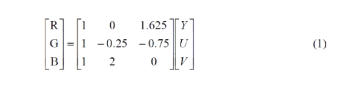
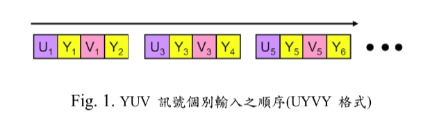
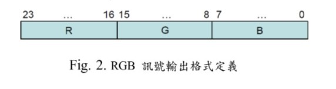
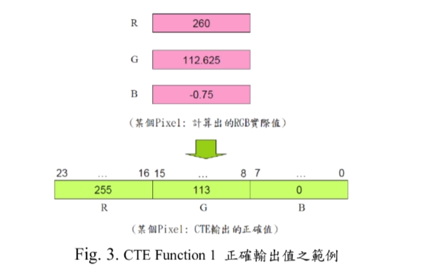
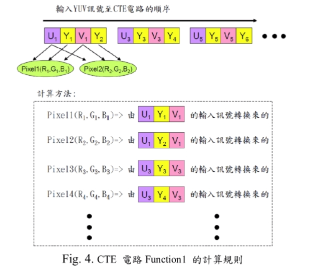
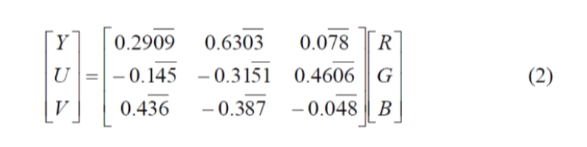
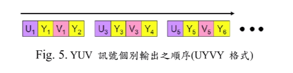
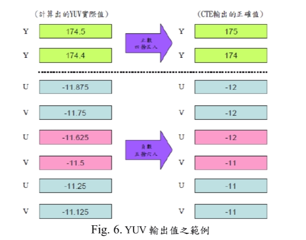
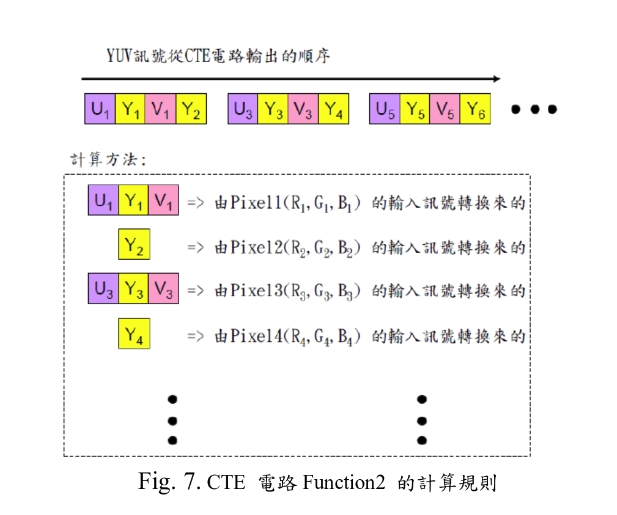

# Digital IC Design

## Color Transform Engine

### Introduction
- Please complete the circuit design of a ColorTransformEngine (hereafter expressed in CTE). The CTE circuit has two functions: converting the YUV signal of each pixel (Pixel) of the color signal into an RGB signal, and converting the RGB signal of each Pixel of the color signal into a YUV signal. Each Pixel of a color image is a combination of the strengths and weaknesses of the three primary colors of R (Red), G (Green), and B (Blue) to determine the color of a Pixel, for example: RGB three primary color components (R, G, B) => (0, 0, 0) (that is, the weakest), the Pixel will appear black, when the RGB three primary color components (R, G, B) => (255, 255, 255) (that is, the strongest), Pixel will appear white, so adjusting the values of the RGB three primary color components can call up a variety of colors based on different applications. Another representation of color images is represented by the YUV model, where Y is the brightness signal (Luminance) , U is the hue (Hue), and V is the saturation (Saturation). The relationship between the RGB color model and the YUV color model can be described by a matrix type, which can be mutually converted. The YUV model is characterized in that each image Pixel only needs a separate Y signal component to determine a grayscale image. As for the U and V signals related to the color, the Pixel of the image is determined according to the strength of the component. The color. The human eye is less sensitive to color signals, so the color signal for each Pixel often uses the DownSample mechanism to save memory space or reduce data transfer.

- The YUV color model is converted into an RGB color model whose matrix is expressed as (1). The "Function 1" of the CTE circuit is to convert the YUV signal into an RGB signal.

- YUV is input signals of one-dimension of 8 bits, and the output signals of Y, U, and V are all 8 bits. The range of Y is an integer value from 0 to 255, and the range of U is an integer value from -117 to +117. The range of V is an integer value from -111 to +111. Testbench's YUV input signal has been processed for the Down Sample for U and V signals in advance. Therefore, assuming the Y signal is to provide N data, and the U and V signals are provided as N/2 data, Y, U, and V signals is input individually, and its input sequence is in UYVY format. The input sequence of this format is shown in Fig. 1. (Note: All negative values are represented by 2's complement.)

- The R, G, and B signals are all 8bits. "Function 1" will output one Pixel at a time. Each Pixel is composed of three RGB signals. Therefore, the total of 24 bits is RGB signal output format definition as shown in Fig. 2. 

- The R, G, and B signals are all 8 bits. The output values of the R, G, and B individual signals are all integer values from 0 to 255. When the output value is less than 0, the output is 0. When the output value is greater than 255, the output is 255, when the output value is between 0 and 255, if there is a fractional part, it will take rounding off to get an integer, such as shown in fig. 3. (Note: The rounding mechanism is only done at the output, the processing of the calculation should not be rounded off!)

- "Function 1" of the CTE is defined by fig.4. It has the meaning that the first output of the CTE is Pixel1, and the R1, G1, and B1 signal are converted by input signal of Y1, U1, and V1 via the matrix operation (1). In the same way, the second output is Pixel2, and the R2, G2, B2 signal value are converted by the input signal of Y2, U1, V1 via the matrix operation of (1), and so on.

- When YUV is converted into RGB signal, the output value must be completely in accordance with the requirements after rounding off, and no allowable error to occur, then Functionl is correctly completed. The RGB color model is converted into a YUV color model, and its matrix representation is expressed as (2). R, G, B signals are 8 bits, "Function 2" will input a Pixel each time, each Pixel is composed of three RGB signals, therefor, a total of 24 bits, R, G, B signals are 8 bits, so the range of RGB are integer values from 0-255. YUV is a one-dimensional output of 8 bits. U and V also uses the Down Sample mechanism, so the CTE need to Down Sample before output U and V (that is, assuming the Y signal will output N data, U and V signal will output N/2 data), Y, U and V signal is individual output,The output sequence is in UYVY format, and the output order of the format is as shown in fig. 5.

Output signal of Y, U and V are all 8bits, the range of Y is an integer from 0 to 255, the range of U is an integer from -117 to +117, the range of V is an integer from -111 to +111. When the value exceeds its range, it must be automatically corrected to the range boundary value. (Note: All negative values are represented by 2's Complement.)

- "Function 2" of the CTE is defined in Fig. 7. The meaning of the output signal Y1, U1 and V1 signal value of the CTE will be converted from the input signal of R1, G1 and B1 via the matrix operation of (2), and the Y2 signal value will be converted form the input signal of R2, G2 and B2 via the matrix operation of (2), and so on. Since the coefficients in the matrix of (2) are all repeating decimal, when the YUV signal is converted, the error value can be allowed to occur, but the difference between the error value and the golden pattern is larger, and the score will be lower.

## AUTHORS
[Yu-Tong Shen](https://github.com/yutongshen/)
